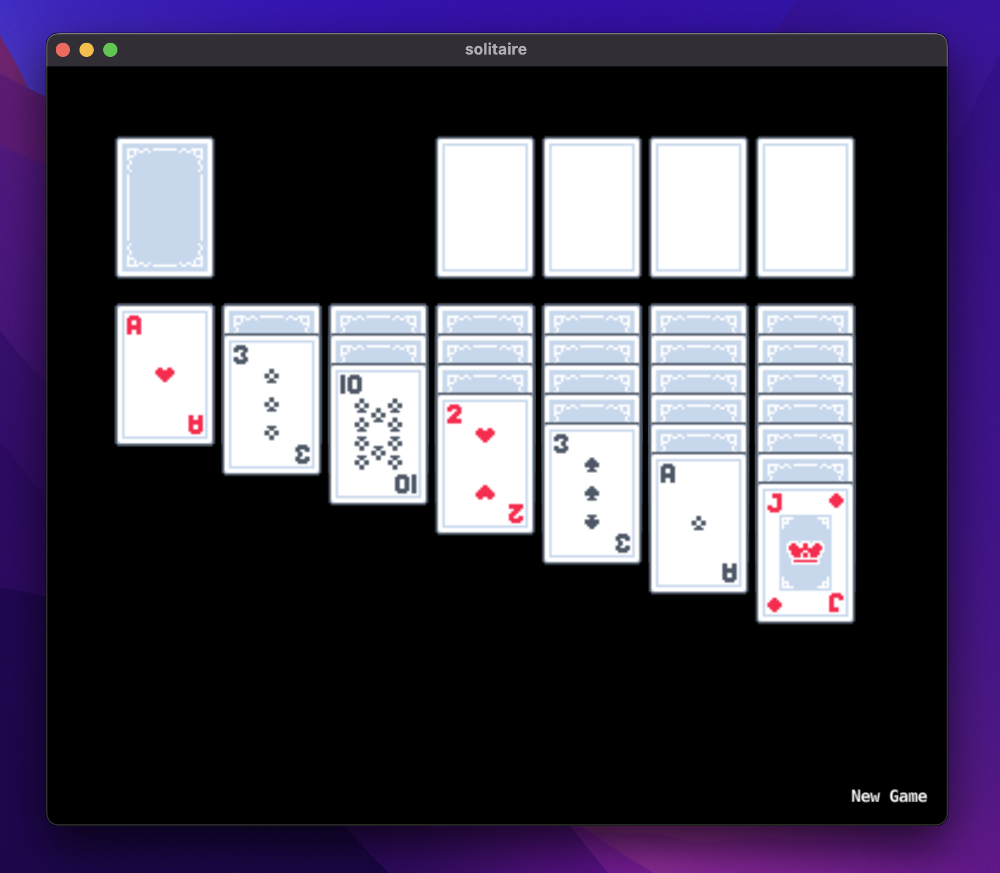

# Solitaire

This is a solitaire game build usig the defold game engine. It has a few nice animations ad some nice to have features like autosolve.

# Building locally

The assets are not included in the GitHub repo, but I built using Kenny's [card asset pack](https://kenney.nl/assets/playing-cards-pack) I believe any cards should work as long as they are 58x40 and adhere to the naming scheme `card_<suit>_face.png`. Otherwise you might have to modify the atlas ad layout